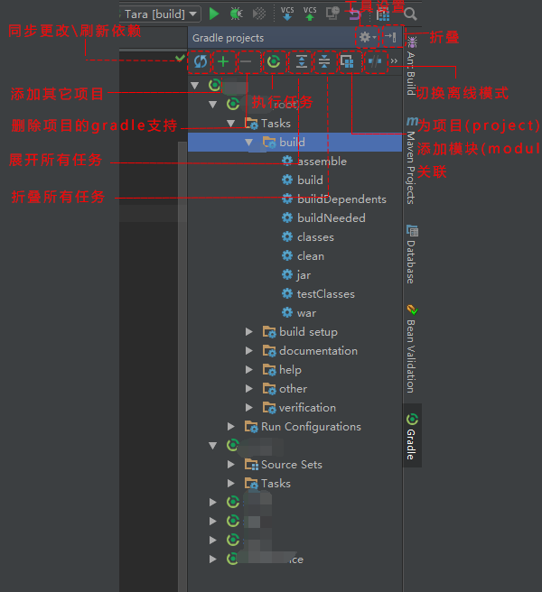

#### IDEA中Gradle插件的使用

Idea本身已经集成了Gradle插件,你可以在File | Settings | Build, Execution, Deployment | Build Tools | Gradle 下找到 相关配置

#### 配置

> 本文基于IDEA 2016.2

| 配置项 | 说明 |
|--------|--------|
| Linked Gradle projects  | 所有Gradle添加了Gradle支持的项目列表|

| 项目相关配置 | 说明 |
|----------------|
| Use auto-import  | 是否开启自动导入,若开启修改gradle脚本文件后会自动检测变化并对项目进行刷新 |
| Create directories for empty content roots automatically   | 导入或者创建gradle项目时,是否自动创建[标准目录结构](../ch3/1.项目结构.md) |
| Create separate module per source set  | 让每个模块单独采用Gradle约定的source set结构去执行构建 |
| Use default gradle wrapper (recommended)   | 使用Gradle Wrapper(如果一定要翻译的话,可以称之为Gradle 包装器),这可以使得项目组成员不必预先安装好gradle即可执行gradle脚本,同时也便于统一项目所使用的gradle版本,当然虽说是不必预装其实是它会自己去官网帮你下载一个,然而gradle安装包体积不小同时又有墙的过滤,所以开启此项最好事先备好梯子. |
| Use gradle wrapper task configuration   | 自定义Gradle Wrapper配置,如可以更改发行包下载地址为你的内网地址便不存在上一条中的翻墙\下载失败\速度慢的问题了,示例代码|
| Use local gradle distribution  | 采用本地安装的Gradle执行脚本 |
| Gradle home   | 选择你的Gradle安装目录即可,无需选择到bin |
| Gradle JVM   | 选择构建Gradle项目使用的JVM,默认是项目采用的JDK  |

| 全局相关配置 | 说明 |
|----------------|
| Offline work | 离线模式,开启离线模式后,Gradle将不会联网查找依赖,而是仅从本地缓存中查找,所以要慎重开启此选项 |
| Service directory path  | 修改Gradle的默认缓存目录,该项也可以通过添加GRADLE_USER_HOME环境变量进行设置,默认值是 «USER_HOME»/.gradle文件夹,更多设置方式参考 [如何修改Gradle的缓存目录](https://github.com/pkaq/GradleSide/tree/master/12-gradleCacheHome) |
| Gradle VM options - | 设置jvm参数,可以采用空格分隔不同的参数设置 比如 " -client -ea -Xmx1024m" 也可以通过Gradle的-D参数对相关参数进行设置 |

#### 应用
看到你的IDEA右侧竖向的标签页,找到gradle点开可以在这里看到你的项目以及相应任务,双击或者右键可以执行相应任务.
如果未开启auto import选项,可以点击菜单上方的蓝色圈圈 进行手动同步

#### 为已有项目添加Gradle支持

可以通过重新import 或者 关闭项目 重新打开 会自动弹出引导窗口 进行相关配置
这里需要保证你的gradle脚本没有问题,否则及时完成引导设置右侧也无法看到gradle页签的.

#### 项目文件
- .gradle gradle项目产生文件（自动编译工具产生的文件） 
- build 自动构建时生成文件的地方 
- gradle 自动完成gradle环境支持文件夹 
- build.gradle gradle 项目自动编译的配置文件 
- gradle.properties gradle 运行环境配置文件 
- gradlew 自动完成 gradle 环境的linux mac 脚本，配合gradle 文件夹使用 代替gradle 命令实现自动完成gradle环境搭建,配合gradle文件夹的内容
- gradlew.bat 自动完成 gradle 环境的windows 脚本，配合gradle 文件夹使用 
>上面两个文件会做如下几件事情
>1.解析 gradle/wrapper/gradle-wrapper.properties 文件，获取项目需要的 gradle 版本下载地址
>2.判断本地用户目录下的 ./gradle 目录下是否存在该版本，不存在该版本，走第3点，存在走第4点
>3.下载 gradle-wrapper.properties 指定版本，并解压到用户目录的下 ./gradle 文件下
>4.利用 ./gradle 目录下对应的版本的 gradle 进行相应自动编译操作

- setting.gradle gradle 项目的子项目包含文件 

#### Gradle工具窗口
可以通过View -> Tool windows -> Gradle 打开,也可以从右侧纵向标签页点击打开.
